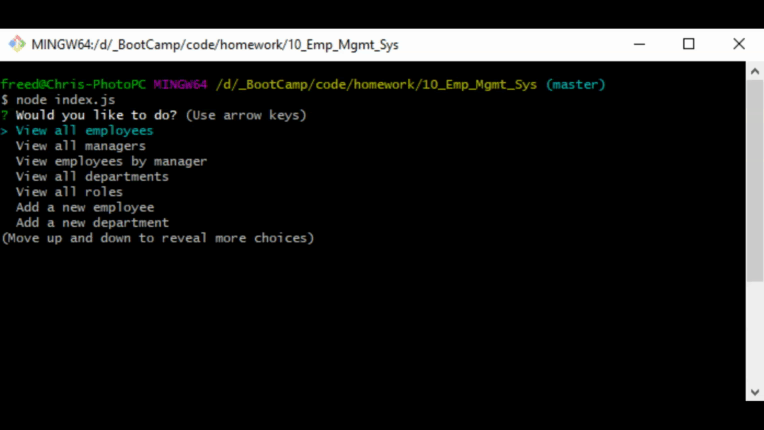

# 10_Emp_Mgmt_Sys

### Table of Contents
- [Description](#Description)
- [Technologies-Libraries](#Technologies-Libraries)
- [Screenshots](#Screenshots)
- [Link](#Link)
​
### Description
This assignment is using SQL as a database. The premise is to track employees. The assignment uses 3 tables to track the employee, the departments and the roles within the company. This is a CLI app, so there is no interface HTML interface to view.  The available options are:

> * **View all employees**
>     * A select of all the employees, I also brought in their role and department as well
> * **View all managers**
>    * For this I decided that any employee without a manage is a manager, so my select looks for users without a manager ID
> * **View employees by manager**
>    * For this task I select a manager and then do a search for any employee that has a manager id that matches
> * **View all departments**
>    * A simple select of everything
> * **View all roles**
>    * A simple select of all roles
> * **Add a new employee**
>    * For this I ask questions and use the role table to fill in any information n the dept.
> * **Add a new department**
>    * This table has only one field to add
> * **Add a new role**
>    * This table holds the role title and the salary of the role
> * **Update an employee's role**
>    * For this I seach for the employee to update, then offer the roles that are loaded as options for the employee to be altered to
> * **Update an employee's manager**
>    * For this I search the employee, Once I have them I offer a list of manager options, including None, so that the employee can be made a manager

### Technologies-Libraries
- [NodeJS](https://nodejs.dev/) - Server side code
- [inquirer](https://www.npmjs.com/search?q=inquirer) - User inputs on the command line
- [mysql](https://www.mysql.com/) - MySQL DB
​
### Screenshots
​

​
### Link
Check it out! 
https://github.com/chrisneal72/10_Emp_Mgmt_Sys
